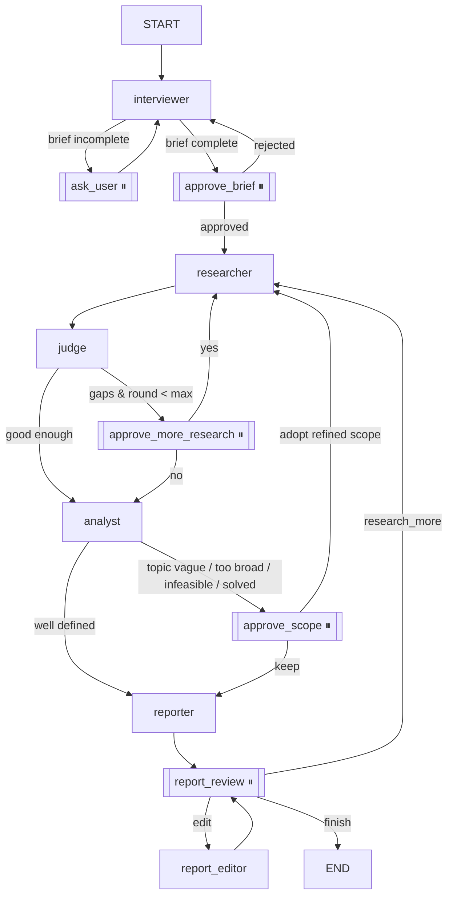

# Research Assistant — LangGraph Multi-Agent System (COE749)

Give it a project idea; five agents turn it into a critically analyzed, researched starting point:

| Agent | Responsibility | Tools | Structured output |
|---|---|---|---|
| **Interviewer** | Chats step by step (it picks its own strategy) until it has what research needs | — | `InterviewTurn` → `ProjectBrief` |
| **Researcher** | Finds datasets for every feature and papers for every research question | `search_kaggle_datasets`, `search_huggingface_datasets`, `search_arxiv`, `search_semantic_scholar` | — (tool artifacts → `Dataset`/`Paper` models) |
| **Judge** | Inspects datasets, reads papers, scores them, quotes highlights, finds gaps | `inspect_kaggle_dataset`, `inspect_huggingface_dataset`, `read_paper` | `VerdictBatch` (per batch of 8) + `JudgeReport` |
| **Analyst** | Critical thinking: explains the underlying problem, synthesizes prior work by theme, judges whether the topic is well-defined / too vague / too broad / infeasible / already solved, proposes contribution angles and a refined scope | — | `ProblemAnalysis` |
| **Reporter** | Writes and edits a problem-first, synthesized Markdown report (dataset table and numbered references built by code); exports PDF / Word | — | — |

After the interview the user talks to one **Research Assistant** in the same chat. It answers from the graph state and turns requests such as *"remove face recognition"*, *"make the related work shorter"* or *"research this gap"* into actions that go through the normal interrupt/approval workflow.

## Interface

| Area | What it does |
|---|---|
| Chat | Interview (with a live *interview progress* checklist), inline approval cards, agent outputs with a collapsible reasoning trace, PDF upload, chat actions |
| Project overview | Editable brief (the research memory); changes after research flag *needs re-evaluation*; the Analyst's critical assessment |
| Research library | Papers / datasets with search, source, Judge-status, feature, year filters and sorting; select papers to compare |
| Paper reader | Extracted text (select a passage → Explain / Summarize / Ask AI) or the original PDF; structured summary; the Judge's verdict |
| Compare | Side-by-side table extracted from each paper ("Not reported" when absent) + follow-up questions |
| Research gaps / Evidence map | Judge gaps with evidence and *Research this gap*; project → features → papers / datasets / gaps |
| Report | Section-level AI editing, manual editing, versions with restore, export PDF / Word / Markdown / BibTeX |
| History | Project milestones from `state.log`, plus developer details (MemorySaver checkpoints, raw node log) |

Judge statuses are derived from the Judge's scores: **Accepted** ≥ 70 %, **Needs review** 40–69 %, **Rejected** < 40 % (or not valid).

Frontend layout: `frontend/src/lib` (API client, session store, router, research helpers), `components/ui` (primitives), `components/layout`, `components/chat`, `components/research`, `components/project`, `components/report`; styles in `src/styles/tokens.css` (design tokens) and `src/styles/app.css`.

## Graph



**Live "thinking" panel.** Agents call `emit(...)` (`backend/app/activity.py`), which writes to LangGraph's
`custom` stream (`get_stream_writer`); the server runs the graph with `stream_mode=["updates", "custom"]`.
The UI shows each step live: the model's own reasoning summaries (Gemini `include_thoughts` / Claude
summarized thinking), every search (source + query) with the links it returned, what the Judge read,
batch scores, and each agent's decision. The full history is in the **Activity** tab.

**Saved projects.** After every run the session is saved to `backend/data/projects/<id>.json`
(`backend/app/projects.py`). The graph still uses the in-memory `MemorySaver`: opening a project writes the
saved state back with `graph.update_state(config, values, as_node=<node before the paused one>)`, so it
resumes exactly where it stopped; a finished project reopens at the report review.

⏸ = human-in-the-loop node using `interrupt()`; the paused state lives in the **MemorySaver** checkpointer until the UI resumes it with `Command(resume=...)`.

**Where the requirements are satisfied**

| Requirement | Location |
|---|---|
| ≥3 agent roles | `backend/app/agents/` (interviewer, researcher, judge, analyst, reporter) |
| Different toolsets | `backend/app/tools/research_tools.py` vs `backend/app/tools/judge_tools.py` |
| Pydantic `BaseModel` state + MemorySaver | `ResearchState` in `backend/app/state.py`; `build_graph()` in `backend/app/graph.py` |
| Structured Output Mode | `with_structured_output(...)` in `backend/app/llm.py`, used by the Interviewer (`InterviewTurn`), Judge (`VerdictBatch`, `JudgeReport`), Analyst (`ProblemAnalysis`), Assistant (`AssistantReply`) |
| Non-string + Optional fields | `int`, `float`, `bool`, `List[...]`, `Dict[str, DatasetVerdict]`, nested models, `Optional[ProjectBrief]`, `Optional[float]` … |
| Conditional edges | seven `route_*` functions in `backend/app/graph.py` (e.g. `route_after_judge`, `route_after_analyst`) |
| Evidence of partial state updates | `state.log`, `cli.py` (prints each node's delta), UI "State & log" tab + `/history` checkpoints |

## Setup

Requirements: Python 3.10+, Node 18+.

### 1. Backend

```bash
cd backend
python -m venv .venv
# Windows: .venv\Scripts\activate    macOS/Linux: source .venv/bin/activate
pip install -r requirements.txt
cp .env.example .env        # then fill in the keys
```

Environment variables (`backend/.env`):

| Variable | Required | Notes |
|---|---|---|
| `LLM_PROVIDER` | yes | `gemini` or `claude` |
| `GOOGLE_API_KEY` | if gemini | free at https://aistudio.google.com/apikey |
| `GEMINI_MODEL` | no | default `gemini-2.5-flash` |
| `ANTHROPIC_API_KEY` | if claude | from https://console.anthropic.com (a Claude.ai subscription is not an API key) |
| `CLAUDE_MODEL` | no | default `claude-opus-5` |
| `KAGGLE_API_TOKEN` | recommended | Kaggle → Settings → API → Generate New Token (`KGAT_...`). Legacy `KAGGLE_USERNAME` + `KAGGLE_KEY` also work. Without them Kaggle is skipped. |
| `S2_API_KEY` | no | Semantic Scholar works without a key but is rate-limited |

### 2. Frontend

```bash
cd frontend
npm install
```

## Run

**Easiest:** double-click `start.bat` (Windows) or run `./start.sh` (macOS/Linux).
It installs anything missing, builds the UI, starts the server and opens **http://localhost:8000**.

**Development mode** (hot reload for the UI, two terminals):

```bash
# terminal 1
cd backend && uvicorn app.server:app --reload --port 8000
# terminal 2
cd frontend && npm run dev          # open http://localhost:5173
```

Terminal-only demo (prints every node's partial state update):

```bash
cd backend && python cli.py "predict crop yield in Lebanon from weather and soil data"
```

On Windows, set `PYTHONIOENCODING=utf-8` first if the console shows encoding errors.
With the free Gemini tier a full run takes ~5–8 minutes (the Judge reads PDFs, and rate limits add retries).

## API

| Method | Path | Purpose |
|---|---|---|
| POST | `/api/sessions` `{idea}` | new thread, starts the Interviewer |
| GET | `/api/sessions/{id}` | current state + pending interrupt (UI polls this) |
| POST | `/api/sessions/{id}/resume` `{value}` | answer / approve / edit → `Command(resume=value)` |
| POST | `/api/sessions/{id}/chat` `{message}` | side-chat assistant |
| GET | `/api/sessions/{id}/history` | MemorySaver checkpoint history |
| GET | `/api/sessions/{id}/report.{md,pdf,docx,bib}` | export the report (or references as BibTeX) |
| PUT | `/api/sessions/{id}/brief` | edit the project brief |
| GET | `/api/sessions/{id}/paper/text` · `/paper/pdf` `?paper_id=` | reader text / original PDF (only from the paper's own open-access link) |
| POST | `/api/sessions/{id}/papers/upload` | upload a PDF (text extraction, metadata, Judge evaluation) |
| POST | `/api/sessions/{id}/paper/summary` · `/paper/evaluate` | structured summary / Judge evaluation of one paper |
| POST | `/api/sessions/{id}/compare` `{paper_ids}` | structured comparison of 2–5 papers |
| POST | `/api/sessions/{id}/ask` `{kind, ids, message, selection?}` | source-specific Q&A (paper, dataset, comparison, gap) |
| PUT / POST | `/api/sessions/{id}/report` · `/report/revert` | manual report edit / restore a version |
| GET | `/api/config` | provider, model and which sources are configured |

## Project layout

```
backend/
  app/
    state.py        Pydantic state + structured-output schemas
    llm.py          Gemini/Claude switch, structured() helper
    graph.py        nodes, edges, conditional routing, MemorySaver
    server.py       FastAPI (also serves the built UI)
    export.py       report → PDF / Word
    agents/         interviewer, researcher, judge, reporter, human (interrupts), assistant
    tools/          research_tools (search), judge_tools (inspect/read)
  cli.py            terminal demo
frontend/           React (Vite) chat UI
```
